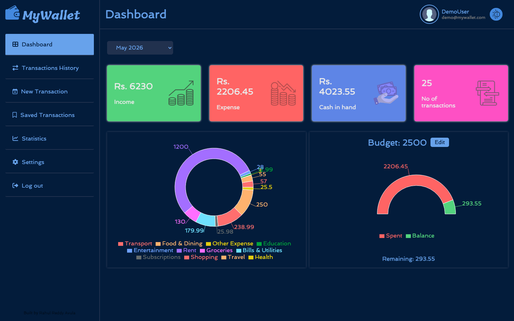
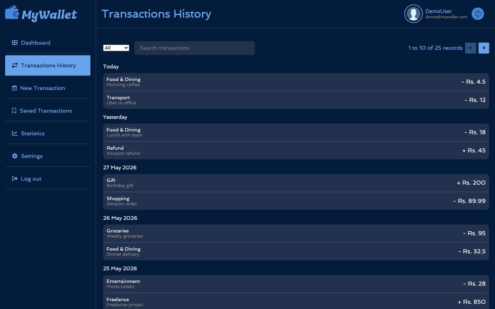
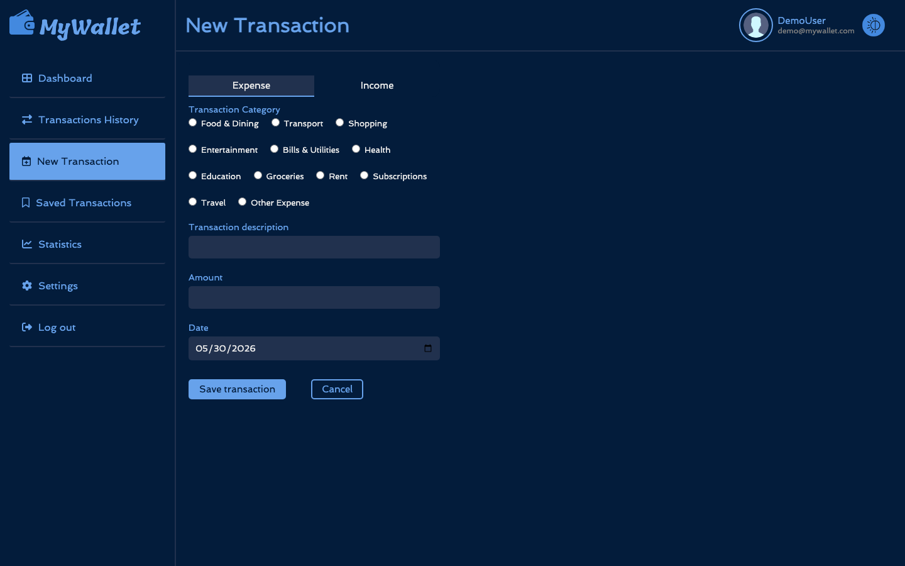
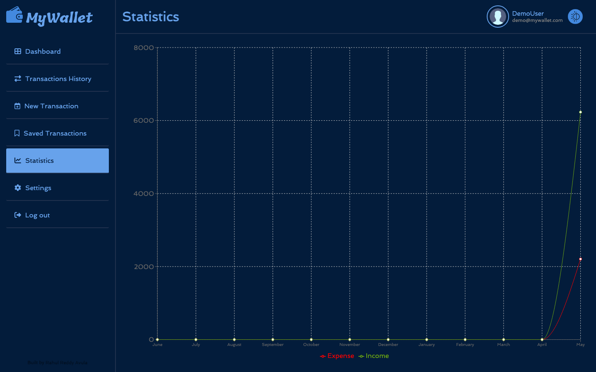
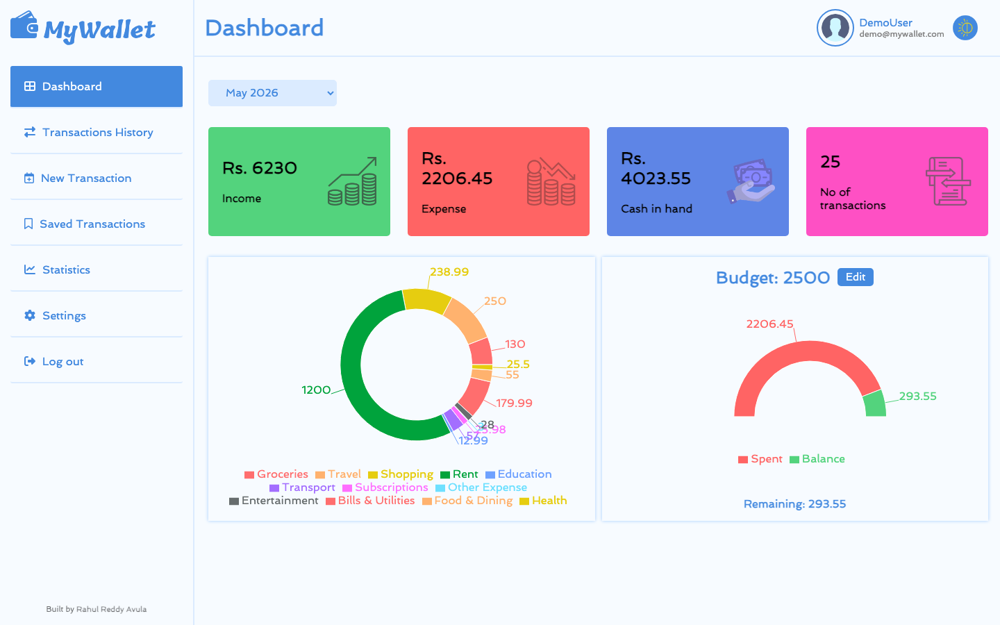

<h1 align="center">💰 MyWallet — Full-Stack Expense Tracker</h1>

<p align="center">
  <em>A modern personal finance app for tracking expenses, income, budgets, and visualizing spending trends.</em>
</p>

<p align="center">
  
  
  
  
  
  
</p>

---

## 🎥 Demo Video

> **▶️ Watch the full demo:** _[YouTube link — paste yours here]_

---

## 📑 Table of Contents

- [Features](#-features)
- [Tech Stack](#-tech-stack)
- [Screenshots](#-screenshots)
- [Architecture](#-architecture)
- [Getting Started Locally](#-getting-started-locally)
- [Project Structure](#-project-structure)
- [What I Built / Learned](#-what-i-built--learned)

---

## ✨ Features

### For Users
- 🔐 **Secure JWT Authentication** — sign up, sign in, forgot password flow
- 💸 **Track Expenses & Income** — 12 expense categories + 6 income categories
- 📊 **Visual Dashboard** — real-time bubble chart of expense distribution, budget gauge
- 📅 **Monthly Summaries** — switch between months to view historical data
- 🔍 **Smart Search** — filter transactions by category, description, or amount
- 📌 **Saved Transactions** — bookmark recurring transactions for one-click entry
- 📈 **Statistics Page** — 12-month line chart comparing income vs expenses
- 🎯 **Budget Goals** — set monthly budgets, get visual feedback on overspending
- 🌗 **Dark / Light Mode** — toggle theme based on preference
- 👤 **Profile Management** — update password, change profile picture

### For Admins
- 👥 Manage users (view, activate, deactivate)
- 🏷️ Manage categories
- 📊 View all transactions across the platform

---

## 🛠 Tech Stack

| Layer | Technologies |
|-------|--------------|
| **Frontend** | React 18, React Router, React Hook Form, Chart.js, Axios, CSS3 |
| **Backend** | Spring Boot 3.x, Spring Security, Spring Data JPA, JWT, Maven |
| **Database** | H2 (file-based, persists across restarts) |
| **Auth** | JWT (stateless), BCrypt password hashing, role-based authorization (USER / ADMIN) |
| **Build Tools** | Maven (backend), npm (frontend) |
| **Language** | Java 21, JavaScript (ES6+) |

---

## 📸 Screenshots

> _Replace these placeholders with your own screenshots once added to the repo._

### 🏠 Landing Page


### 🔐 Login & Registration


### 📊 Dashboard (Dark Mode)


### 💸 Transactions History


### ➕ New Transaction


### 📈 Statistics


### 🌗 Light Mode


---

## 🏗 Architecture

```
┌──────────────────┐      HTTPS + JWT       ┌────────────────────┐      JDBC      ┌──────────┐
│   React Frontend │ ─────────────────────► │  Spring Boot API   │ ─────────────► │    H2    │
│   (Port 3000)    │ ◄───── JSON ─────────  │  (Port 8080)       │ ◄───────────── │ Database │
└──────────────────┘                        └────────────────────┘                └──────────┘
       │                                              │
       └── Static UI, Charts.js                       └── Stateless JWT auth, BCrypt, JPA
```

- **Stateless authentication** with JWT tokens stored in `localStorage`
- **Role-based authorization** via Spring Security `@PreAuthorize` annotations
- **File-based H2 database** persists data across server restarts (no external DB needed for dev)
- **CORS-enabled** REST API designed for separate frontend deployment

---

## 🚀 Getting Started Locally

### Prerequisites
- Java 21+
- Node.js 18+
- Maven 3.8+

### 1. Clone the Repository

```bash
git clone https://github.com/Rahul200512/Fullstack-Expense-Tracker.git
cd Fullstack-Expense-Tracker
```

### 2. Run the Backend

```bash
cd backend
mvn clean install
mvn spring-boot:run
```

Backend runs at `http://localhost:8080`. The H2 database is auto-initialized with:
- 12 expense categories + 6 income categories (seeded)
- A demo user: `demo@mywallet.com` / `Demo@1234` (seeded with 25 sample transactions)

H2 Console (optional): `http://localhost:8080/mywallet/h2-console`

### 3. Run the Frontend

```bash
cd frontend
npm install
npm start
```

Frontend runs at `http://localhost:3000`.

### 4. Try It Out

- Open `http://localhost:3000`
- Click **Try Demo** to log in with the seeded demo account, OR
- Click **Create Account** to register your own

---

## 📂 Project Structure

```
Fullstack-Expense-Tracker/
├── backend/
│   ├── src/main/java/com/fullStack/expenseTracker/
│   │   ├── controllers/      # REST endpoints
│   │   ├── services/         # Business logic
│   │   ├── models/           # JPA entities
│   │   ├── dto/              # Request / response DTOs
│   │   ├── security/         # JWT, Spring Security config
│   │   ├── dataSeeders/      # Auto-seed roles, categories, demo user
│   │   └── exceptions/       # Custom exception handlers
│   └── src/main/resources/
│       └── application.properties
├── frontend/
│   ├── src/
│   │   ├── pages/            # Login, Register, Dashboard, etc.
│   │   ├── components/       # Reusable UI
│   │   ├── services/         # API calls (Axios)
│   │   └── assets/           # CSS, images
│   └── package.json
└── README.md
```

---

## 🎓 What I Built / Learned

This project deepened my understanding of:

- **Spring Security with JWT** — implementing stateless auth from scratch (no third-party libraries beyond `jjwt`)
- **JPA relationships** — `@ManyToMany`, `@ManyToOne` for users / roles / transactions / categories
- **Custom exception handling** — `@ControllerAdvice` for consistent API error responses
- **React Hooks + Context** — state management for auth, theme, transactions
- **Chart.js integration** — translating raw transaction data into bubble charts, donut gauges, and time-series lines
- **Data seeding** — using Spring's `ApplicationReadyEvent` with `@Order` to deterministically populate demo data
- **Form validation** — React Hook Form on the frontend, Bean Validation on the backend

---

## 📄 License

This project is licensed under the [Apache License 2.0](./LICENSE).

---

<p align="center">
  Built with ☕ and 💙 by <a href="https://github.com/Rahul200512">Rahul</a>
</p>
